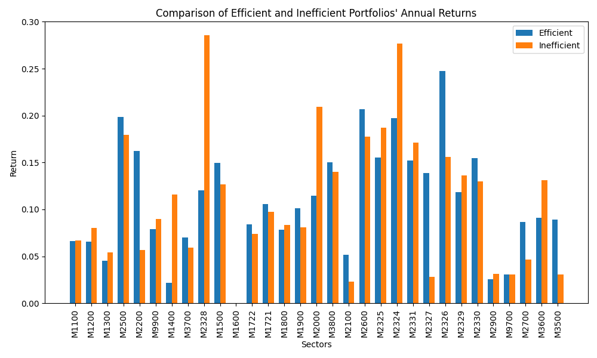
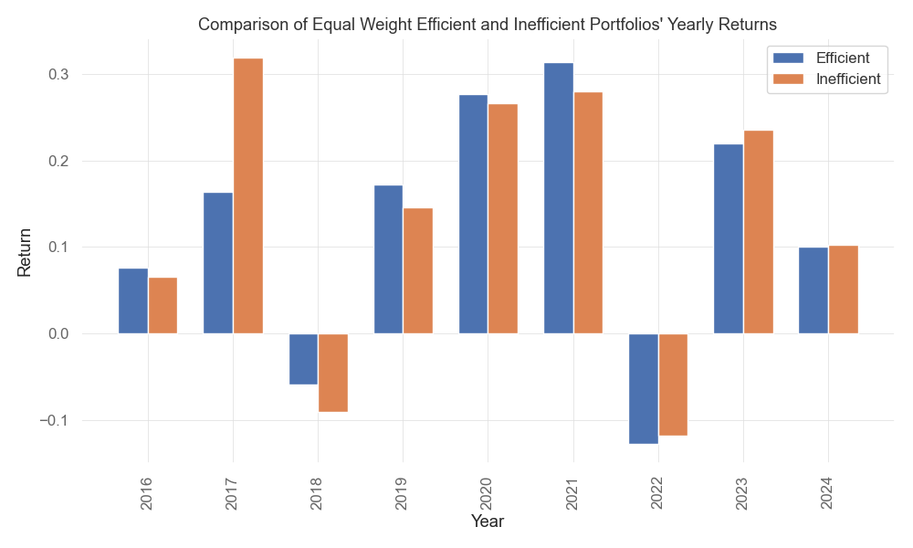
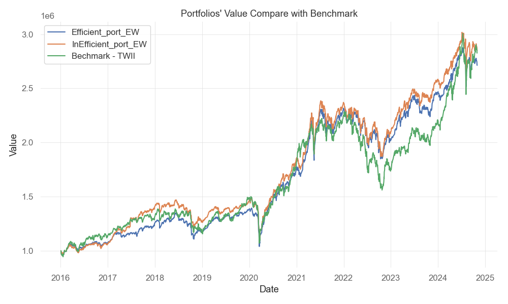

# Stock Selection with PCA and DEA models.
## Files
* `main.py` : Main script to run results.
* `fin_utils.py` : Tools for backtesting strategies.
* `models.py` : PCA and DEA models.
* `./data` : Company data files.
* `./results` : Saved results including performances and figures.
  
## Overview
Using PCA(Principle Component Analysis) and DEA(Data Envelope Analysis) techniques to identify relative efficient firms (stocks), assuming efficient firms will outperform inefficient firms. This assumption is not the case in this demonstration, this may be because we did not consider the stock price performance that may already be priced in.
 
## Data
* Data Source: TEJ, Yahoo Finance
* Time Period: 2015.01.01 - 2024.05.01
* Stocks:  Taiwan Stock market
* Rebalance Frequency: 12 months

## Methodology
### PCA
* A dimensionality reduction technique that transforms correlated variables into a smaller set of uncorrelated components while preserving maximum variance.
* We used this technique to transform fundemental data of many companies.
  
### DEA
* A non-parametric method for evaluating the efficiency of decision-making-units(dmu) by comparing input-output ratios.
* We treat each company as a dmu, and evaluate its relative efficiency.
  
### Evaluation
* Compare top N efficient firms and the least N efficient firms.
* Construct equal weight portfolios for efficient and inefficient firms.
* We evaluate performances in different industry sectors.
  
## Results
### Performance comparison of different sectors

### Performance comparison of different years

### Portfolio performance

